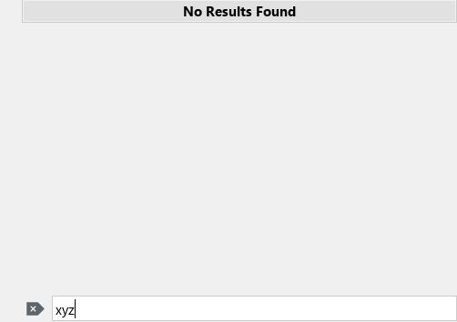

# TDE Kicker Menu Modern Search (Classic Menu search redesign)

A redesign of the search experience for the TDE Classic Menu (KMenu).
This integration brings Windows 10-style instant search filtering to the classic Trinity panel menu.

## Features

*   **Type-to-Search**: Start typing on any alphanumeric key to instantly enter search mode — no dedicated search bar activation required (same UX as the Windows 10 Start Menu). Navigation keys (Enter, ESC, arrows) are not intercepted.
*   **Instant Filtering**: Flat view of matching results as you type, replacing the legacy path highlighting logic.
*   **Bottom-Anchored Search Bar**: Search entry appears at the bottom of the menu only when actively searching.
*   **Dynamic Result Titles**: Live result count ("Search Results (50+)"), empty state feedback ("No Results Found").
*   **Single Match Auto-Launch**: When only one result matches, pressing Enter launches it immediately.
*   **Contextual ESC**: First press clears the search query and returns to normal menu. Second press closes the menu.
*   **Auto-Reset**: Full menu tree is automatically restored after launching an application or dismissing the menu.

## Technical Implementation

### Type-to-Search State Machine
The `m_inFlatSearchMode` flag enables seamless toggling between the traditional hierarchical tree view and the modern flat result view. Search mode activates on first alphanumeric keypress and deactivates on ESC or menu close — no widget detachment/reattachment needed.

### Modified Files
| File | Role |
|------|------|
| `kicker/ui/k_mnu.cpp` | Core search logic, key interception, result filtering |
| `kicker/ui/k_mnu.h` | State machine declarations, search members |
| `kicker/ui/popupmenutitle.cpp` | Custom menu title widget for result headers |
| `kicker/ui/popupmenutitle.h` | Title widget declarations |
| `kicker/CMakeLists.txt` | Build rules + automatic `sstrip` post-install hook |
| `libkicker/CMakeLists.txt` | Library build rules + `sstrip` hook |

## Source Bundle Contents

- `src/` — Optimized source files
- `create_deb.sh` — Debian package generator
- `screenshots/` — UI screenshots

## Build & Installation

### Prerequisites
- TDE development environment (tdebase source tree)
- CMake >= 3.x, GCC, Gold linker
- `sstrip` (optional, for maximum binary optimization)

### Optimized Release Build

From the **tdebase root directory** (e.g. `/home/user/tdebase-trinity-14.1.1`):

1.  **Configure** (parses the full tdebase tree, fast):
    ```bash
    mkdir -p build
    cd build
    cmake .. \
      -DCMAKE_BUILD_TYPE=Release \
      -DCMAKE_INSTALL_PREFIX=/opt/trinity \
      -DCMAKE_CXX_FLAGS="-g0 -O2 -Wl,--relax -Wl,-z,norelro -fstrict-aliasing -flto=auto -ffunction-sections -fdata-sections -fno-ident -fno-plt -fno-asynchronous-unwind-tables -fno-unwind-tables -fomit-frame-pointer -fno-stack-protector -fno-math-errno -ffast-math -fvisibility=hidden -fmerge-all-constants -fuse-ld=gold -Wl,--gc-sections,--build-id=none,--as-needed,--strip-all,-O1,--icf=all,--compress-debug-sections=zlib -s -Wno-deprecated-declarations" \
      -DBUILD_KICKER=ON \
      -DBUILD_ALL=OFF
    ```

2.  **Build** (compiles only kicker):
    ```bash
    cd kicker
    make -j$(nproc)
    ```

3.  **Install** (auto-applies `sstrip` → ~3KB binary):
    ```bash
    sudo make install
    ```

### Debug Build

For development with full debug symbols:
```bash
mkdir -p build && cd build
cmake .. \
  -DCMAKE_BUILD_TYPE=Debug \
  -DCMAKE_INSTALL_PREFIX=/opt/trinity \
  -DBUILD_KICKER=ON \
  -DBUILD_ALL=OFF
cd kicker
make -j$(nproc)
sudo make install
```

## Packaging

Generate a Debian package (from `kicker/` directory):
```bash
./create_deb.sh
```

The script:
1. Runs `make install DESTDIR=...` from the existing build
2. Cherry-picks kicker binaries and libraries
3. Applies `sstrip` for maximum compression
4. Generates `tde-kicker-q4win10_14.1.1_amd64.deb` (~522KB)


## Screenshots

 
 


