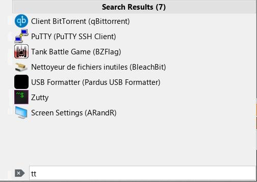
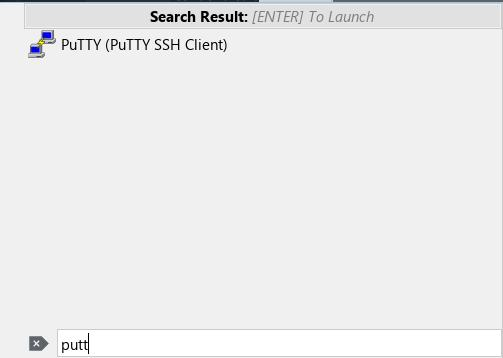

# KMenu Modern Search Integration (Classic Menu)

A redesign of the search experience for the TDE Classic Menu (KMenu). 
This integration ports the instant-filtering search logic to the classic Trinity panel menu.

## Features
*   **Instant Filtering**: Replaces the legacy "path highlighting" logic with an instant, flat view of search 
results as you type.
*   **Bottom-Anchored Search Bar**: Strategic relocation of the search bar to the bottom of the menu for 
better ergonomics and modern aesthetics.
*   **Refined Lifecycle**: 
    *   **Contextual ESC**: Intelligently clears the search query on first press and closes the menu only when 
empty.
    *   **Auto-Reset**: Automatically restores the full menu tree and clears the query after an application is 
launched or the menu is dismissed.

## Technical Implementation
This enhancement utilizes advanced TQt/TDE widget management techniques:

### 1. Robust Widget Persistence
To maintain the search bar at the bottom during dynamic menu re-initialization (which typically wipes all 
children), the implementation uses a **Detachment/Re-attachment pattern**:
- **Detachment**: The search bar container is reparented to `NULL` during the base class `initialize()` wipe.
- **Persistence**: Re-insertion into the primary menu occurs immediately after initialization.
- **Visibility**: Explicit Z-order management (`raise()`) ensures the search bar is always anchored above 
filtered results.

### 2. Flat Search Mode State
The introduction of a `m_inFlatSearchMode` state machine allows the menu to seamlessly toggle between the 
traditional hierarchical tree view and the modern flat result view without reloading resources.

## Source Bundle Contents
- `src/`: Optimized source files (`k_mnu.cpp`, `k_mnu.h`, `popupmenutitle.cpp`, `popupmenutitle.h`).
- `create_deb.sh`: Debian package generator.

## Build & Installation (Optimized Release)

To compile a production-ready, stripped binary:

1.  **Configure**:
    ```bash
    mkdir -p build/kicker
    cd build/kicker
    cmake ../../kicker \
      -DCMAKE_BUILD_TYPE=Release \
      -DCMAKE_INSTALL_PREFIX=/opt/trinity \
      -DCMAKE_CXX_FLAGS="-O2 -flto -fno-plt -s" \
      -DBUILD_KICKER=ON
    ```

2.  **Build**:
    ```bash
    make -j$(nproc)
    ```

3.  **Install (Auto-Stripped)**:
    Simply run `make install`. The build system will automatically apply `sstrip` (if available) or `strip` to the binaries, ensuring an optimized 3KB footprint by default.
    ```bash
    sudo make install
    ```
    *Note: To keep debug symbols, configure with `-DCMAKE_BUILD_TYPE=Debug`.*

## Packaging

To create the Debian package:
```bash
./create_deb.sh
```
The script will automatically build a Release version (if not done), install to a temp dir, apply `sstrip`, and generate the `.deb`.

## Features Added (v14.1.1-modern)
- **Instant Search**: Flat list filtering as you type.
- **Bottom Search Bar**: Search entry anchored to bottom.
- **Rich Results**: Dynamic titles like "Search Results (50+)", "No Results Found".
- **Single Match Launch**: Pressing Enter on a single result launches it immediately.
- **Visuals**: Modern padding, transparent search icon, styling fixes.

## Screenshots


*Standard search with instant results*


*Rich results count and category headers*


*No results state with clean feedback*


